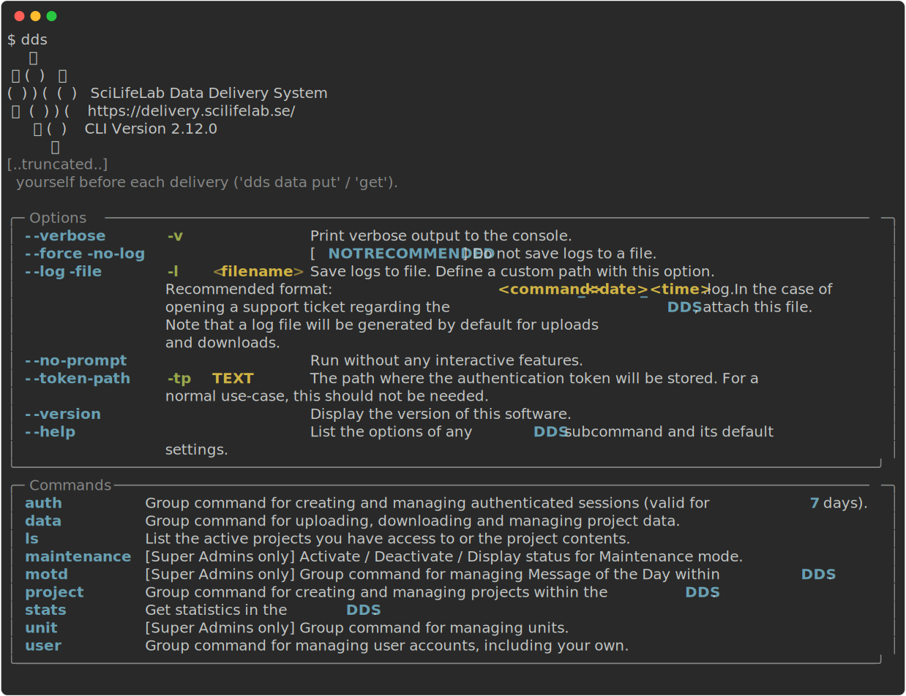

<p>
   <h1 align="center">Data Delivery System: CLI</h1>
</p>

<p align="center">
    <b>A command line tool `dds` to manage projects and data in the SciLifeLab Data Delivery System.</b>
</p>
<br />

<p align="center">

<a href="https://pypi.org/project/dds-cli/">
    
</a>
<a href="https://opensource.org/licenses/MIT">
    
</a>
<a href="[https://opensource.org/licenses/MIT](https://github.com/psf/black)">
    
</a>
<a href="https://prettier.io/">
    
</a>
<br />
<a href="https://github.com/ScilifelabDataCentre/dds_cli/actions/workflows/lint-black-cli.yml">
    
</a>

<a href="https://codecov.io/github/ScilifelabDataCentre/dds_cli" > 
  
 </a>

</p>

<p align="center">
<b>Links</b>
<br />
<a href="https://scilifelabdatacentre.github.io/dds_cli/">
    
</a>
<a href="https://github.com/ScilifelabDataCentre/dds_web/blob/master/doc/Technical-Overview.pdf">
    
</a>
<a href="https://github.com/ScilifelabDataCentre/dds_web/wiki/Architecture-Decision-Record,-ADR">
    
</a>
<a href="https://github.com/ScilifelabDataCentre/dds_web/blob/master/doc/Troubleshooting.pdf">
    
</a>
<a href="https://github.com/ScilifelabDataCentre/dds_web">
    
</a>
</p>

## About

**The Data Delivery System (DDS) is a cloud-based system for all SciLifeLab platforms where data generated throughout each project can be delivered to the research groups in a fast, secure and simple way. The CLI makes requests to the API (see badge below for link) in order to use the API functionality.**

> _The Data Delivery System is developed and maintained by the SciLifeLab Data Centre. National Genomics Infrastructure (NGI) Stockholm has been a part of the development team during 2021 and early 2022._

---

## Table of contents

- [Installation](#installation)
- [Overview of commands](#overview-of-commands)

## Installation

### Python Package Index

The `dds-cli` package can be installed from [PyPI](https://pypi.python.org/pypi/dds_cli/) using pip as follows:

```bash
pip install --upgrade dds-cli
```

After installing, run `dds` (or `dds --help`) and verify that the output looks like this:



### Executables

Executables are available for Windows, MacOS and Linux. These allow you to run the CLI without needing to install it (and the pip / Python requirements) yourself. Download them from the (bottom of the) latest release page: [Latest Release](https://github.com/ScilifelabDataCentre/dds_cli/releases/latest/)

### Development version

If you would like the latest development version of tools, the command is:

```bash
pip install --upgrade --force-reinstall git+https://github.com/ScilifelabDataCentre/dds_cli.git@dev
```

If you intend to make edits to the code, first make a fork of the repository and then clone it locally.
Go to the cloned directory and install with pip (also installs development requirements):

```bash
pip install --upgrade -r requirements-dev.txt -e .
```
