# How to install the DDS CLI on Windows

## 1. Download and install Python > 3.8

### 1.1. Go to https://www.python.org/downloads/windows/

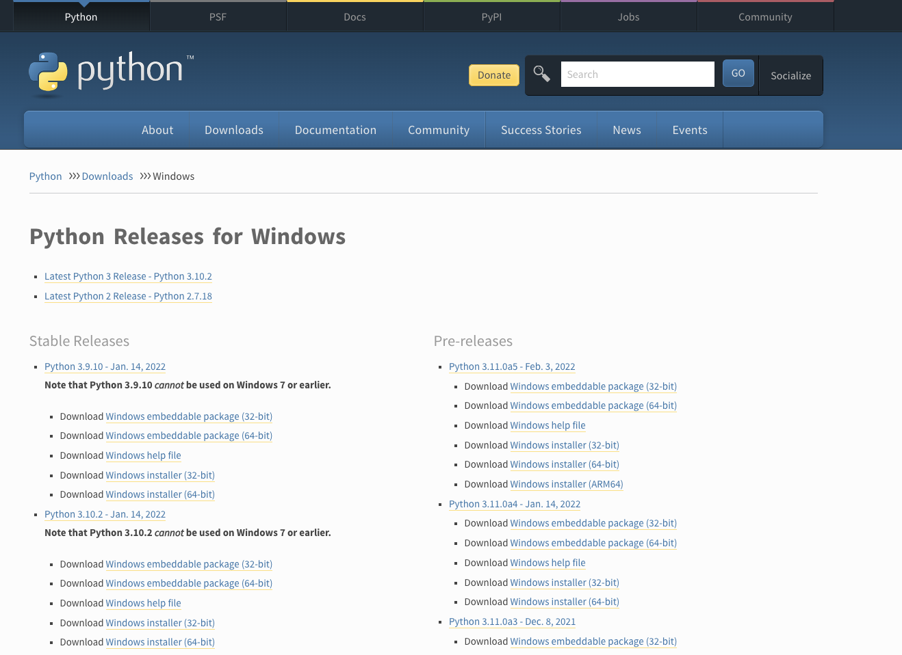

### 1.2. In the left column, locate the **Windows installer** of a suitable version e.g. the **Python 3.9.10 - Jan. 14, 2022** release and download the associated .exe file.

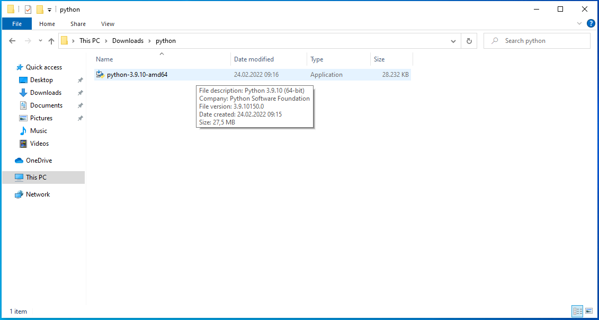

> **Note:** For most systems, the `Windows installer (64-bit) (https://www.python.org/ftp/python/3.9.10/python-3.9.10-amd64.exe)` will be the correct version. If your computer is older than a decade, chances are that you might need to select _32-bit binary_ or a slightly older version of Python.

### 1.3. Click the downloaded **python-3.9.10-amd64.exe**. This will open the Python Installer.

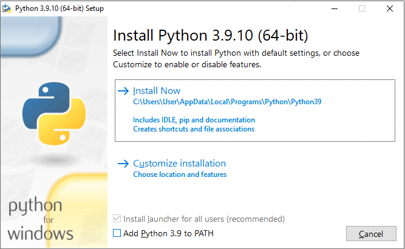

### 1.4. Make sure the **Add Python 3.9 to PATH** box is checked and proceed with the installation.

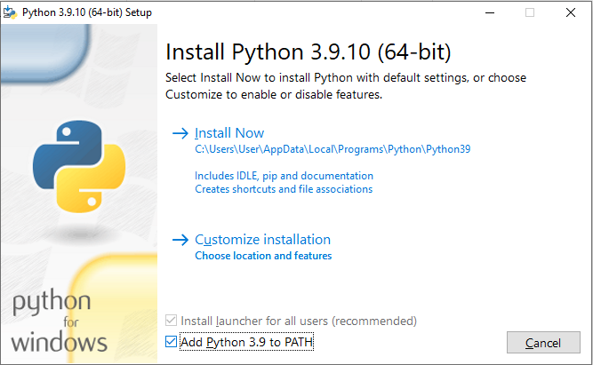

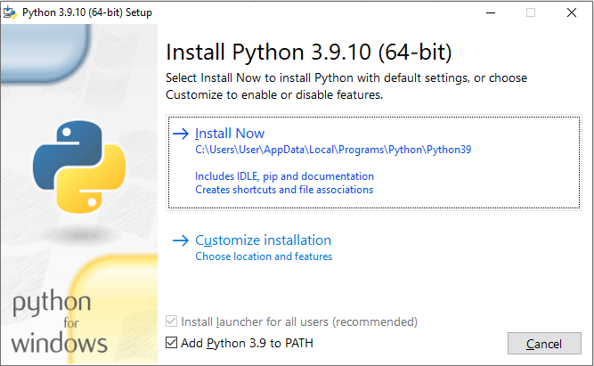

> **Note:** For most users, the default installation options will work. On a shared or office computer, you might need to uncheck the Install launcher for all users, if you lack administrative privileges on the system. To do so, select the Customize installation option.

### 1.5. Click **Install Now** and follow the installer steps. You should be able to click next/continue on all steps. Python will be installed.

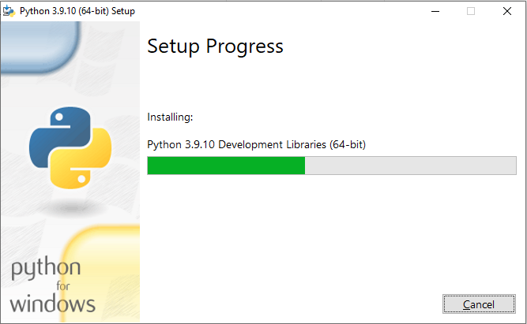

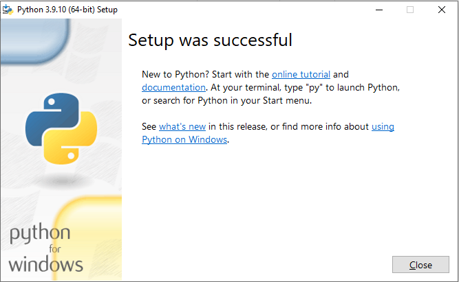

---

## 2. Proceed with a command line application / terminal

### 2.1. From the start menu, launch the default command line application cmd or any other like the PowerShell.

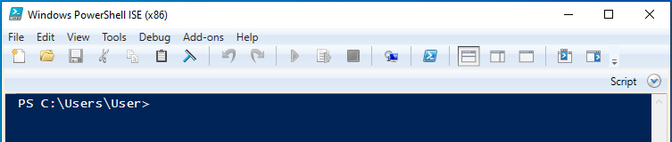

### 2.2. Verify that Python was installed successfully:

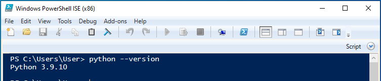

> **Note:** Upon entering `python --version` the version of the previously installed Python distribution should be shown. If a version number < 3.8 is shown or Python is not found, please consult the :ref:`Troubleshooting<troubleshooting>` section below.

### 2.3. Python ships with a helper program called **pip** to install additional packages. In the next step, this software should be upgraded to its current version.

To upgrade pip, enter the command **python -m pip install --upgrade pip** to the terminal.

### 2.4. After pip was successfully upgraded, the Data Delivery System Command Line Interface can be installed:

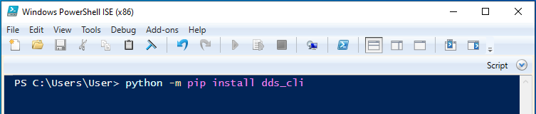

Enter **python -m pip install dds_cli** to start the install. Because several requirements will be automatically installed with the command line interface, several packages will be automatically downloaded:

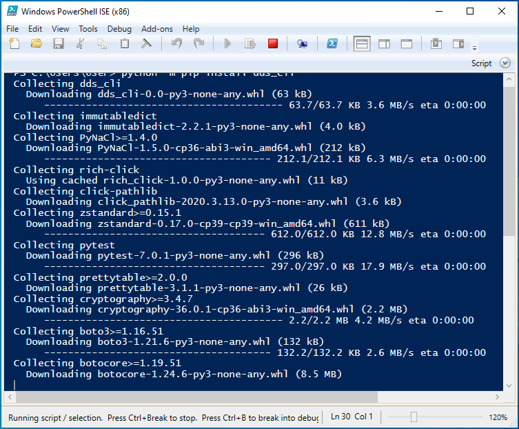

### 2.5. After the installation procedure has completed, the Data Delivery System Command Line Interface can be launched from the command line by entering **dds**. Please consult the general manual, how to interact with the CLI.

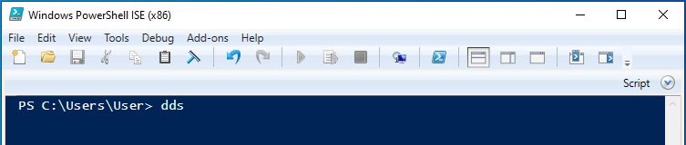

---

## 3. Troubleshooting

### **Python not found or only in a wrong version.**

The most likely reason for this is an issue with the PATH variable, e.g. when the box Add Python 3.9 to Path was not checked during installation.

This can be manually checked and corrected via the Environment Variables.

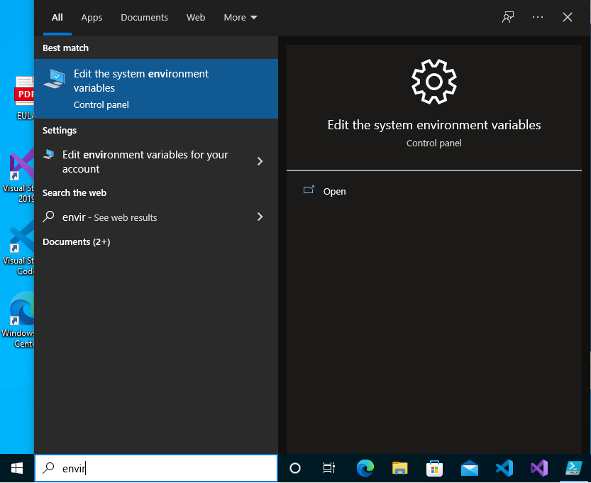

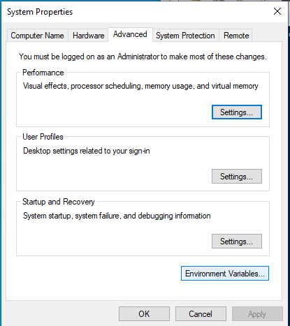

Open the Environment Variables dialogue via the **Advanced** Tab in the **System Properties**.

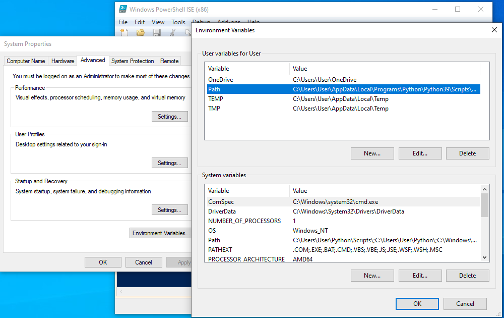

Select **Path** from the list of variables and click edit. Mind that there is a set of variables specific to the user on the top and a system-wide set of variables at the bottom. Both contain a **Path** and depending on the mode of installation, Python might be added to both or just one of them.

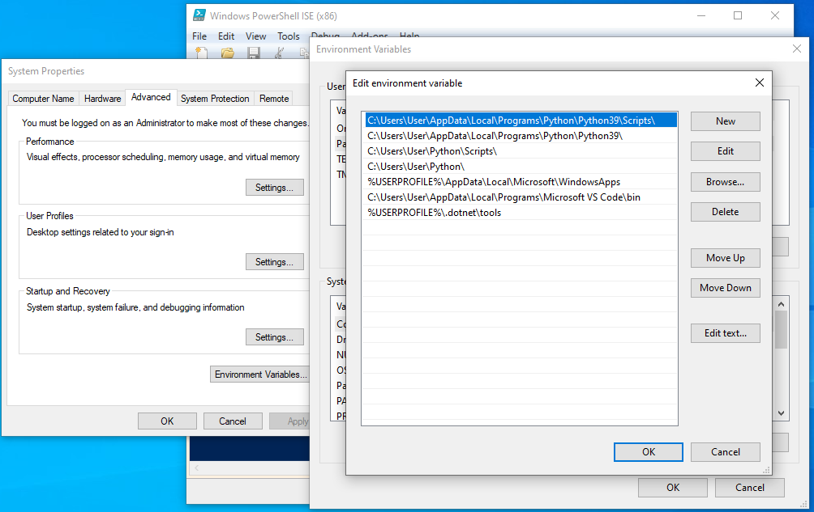

Verify that the directories associated with the installation are present in the Path. If not, add the respective directories manually.

Use the search function first to verify where the Python installation has been added. Typically, all installation paths will contain your username and thus need to be customized. Change the paths shown in the example to: `C:\User\username\AppData ….`

### **Security privileges required.**

It may be possible, that you will need to approve changes to your system explicitly during the install:

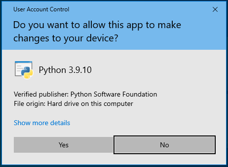

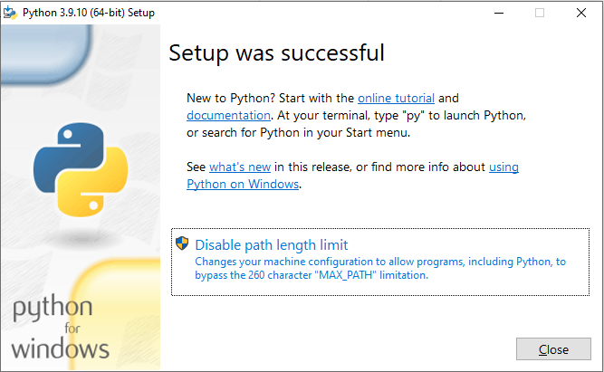

In the latter case - depending on the installation directory - the combined length of all directories in PATH may exceed the length limit. Extending the allowed length should not negatively impact your system.
