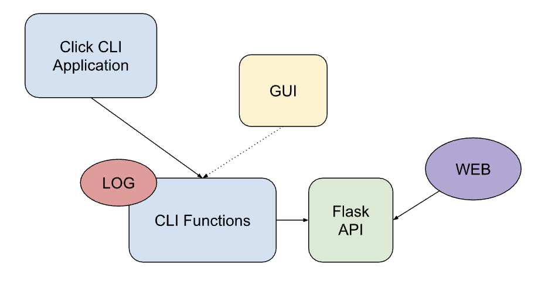

# POC on Auth commands with GUI

## DDS CLI 

### Current setup
Currently no return of the API respone from the middle layer is implemented. Want to make the response availible for the GUI. 



Want to either:
- Move the logging to the click application and make the cli functions return the API response, or
- Keep the logging in the cli functions but make the fuction return the API response

### Example of current implementation

```python
# -- dds user info -- #
@user_group_command.command(name="info")
# Options
# Flags
@click.pass_obj
def get_info_user(click_ctx):
    """Display information connected to your own DDS account.

    Usable by all user roles.

    \b
    The following information should be displayed:
    - Username
    - Role
    - Name
    - Primary email
    - Associated emails (not useful yet)
    """
    try:
        with dds_cli.account_manager.AccountManager(
            no_prompt=click_ctx.get("NO_PROMPT", False),
            token_path=click_ctx.get("TOKEN_PATH"),
        ) as get_info:
            get_info.get_user_info()
    except (
        dds_cli.exceptions.APIError,
        dds_cli.exceptions.AuthenticationError,
        dds_cli.exceptions.DDSCLIException,
        dds_cli.exceptions.ApiResponseError,
        dds_cli.exceptions.ApiRequestError,
    ) as err:
        LOG.error(err)
        sys.exit(1)
```

```python
def get_user_info(self):
        """Get a users info."""
        response, _ = dds_cli.utils.perform_request(
            dds_cli.DDSEndpoint.DISPLAY_USER_INFO,
            headers=self.token,
            method="get",
            error_message="Failed to get user information",
            timeout=dds_cli.DDSEndpoint.TIMEOUT,
        )

        for field in response.get("info", []):
            if isinstance(response["info"][field], str):
                response["info"][field] = rich.markup.escape(response["info"][field])

        info = response.get("info")
        if info:
            LOG.info(
                "Username:          %s \n"
                "Role:              %s \n"
                "Name:              %s \n"
                "Primary Email:     %s \n"
                "Associated Emails: %s \n",
                info["username"],
                info["role"],
                info["name"],
                info["email_primary"],
                ", ".join(str(x) for x in info["emails_all"]),
            )
```

### Comments 

- For some cli functions it's enough to just add a return statement in the method
- The authentication would need to be either reformated or adding a parallel authentication for the gui --> could be a better solution to rewrite the authenticatin flow all together 
- **Problem**: In the current auth flow the sign in and 2fa are done in the same method. and the input of text in the cli are happening inside the method. The GUI solution need the login and 2fa to be seperate methods.
- **Possible Solution**: Try to split up the methods in auth class to smaller methods so the gui can call them.


### Issues with the PyQt implementation 

The idea was to use PyQt6 as a framework for building the GUI for the DDS but Pyqt dont work on alpine and hence would not install in the container enviroment. In addition to this, there is benfifits using a TUI (Terminal UI) as some users are **only** able to run dds in the terminal. There is no loss in functionallity switching from pyqt to textualize. Textualize is confirmed to work with the current docker setup. 

## Executable 

An executable for the gui is made using pyinstaller. There is some "workarounds" needed to make it work:

- The styling (tcss) need to be inline in the correstponding components. This is not a big problem, as the idea would be to write custom widgets, i.e Button --> DDSButton. Additionally, there is not much styling done, a couple of lines for each component at most.
- Pyinstaller sometimes have trouble finding widgets imports, in this instance TabPane. This can be solved by adding the import to "hidden-imports" when making the executable and it will be found.

There are other suggestions from the community, such as [Shiv](https://shiv.readthedocs.io/en/latest/#) and [Nuitka](https://nuitka.net/), for making textual executables.