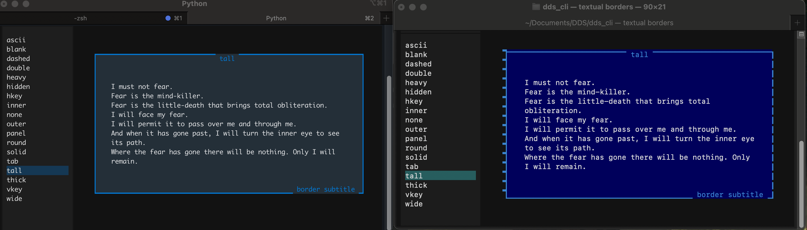
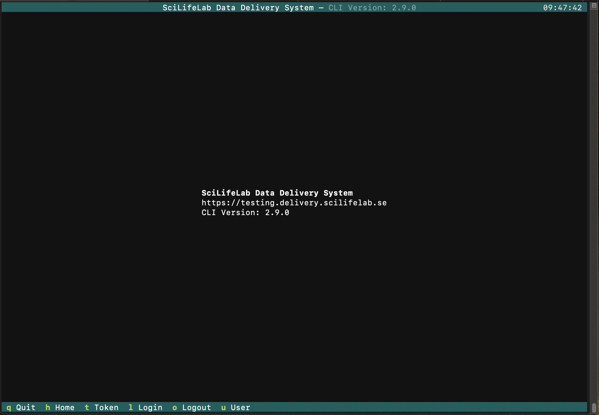
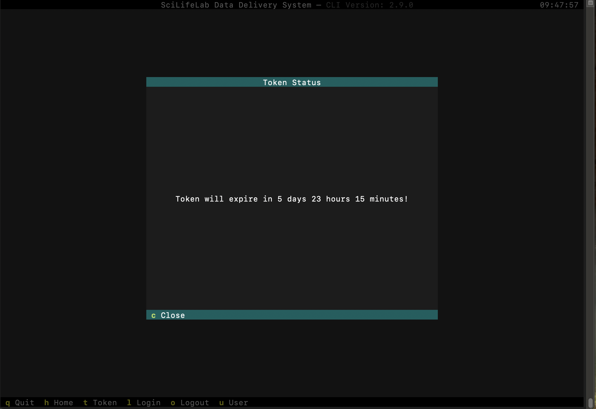
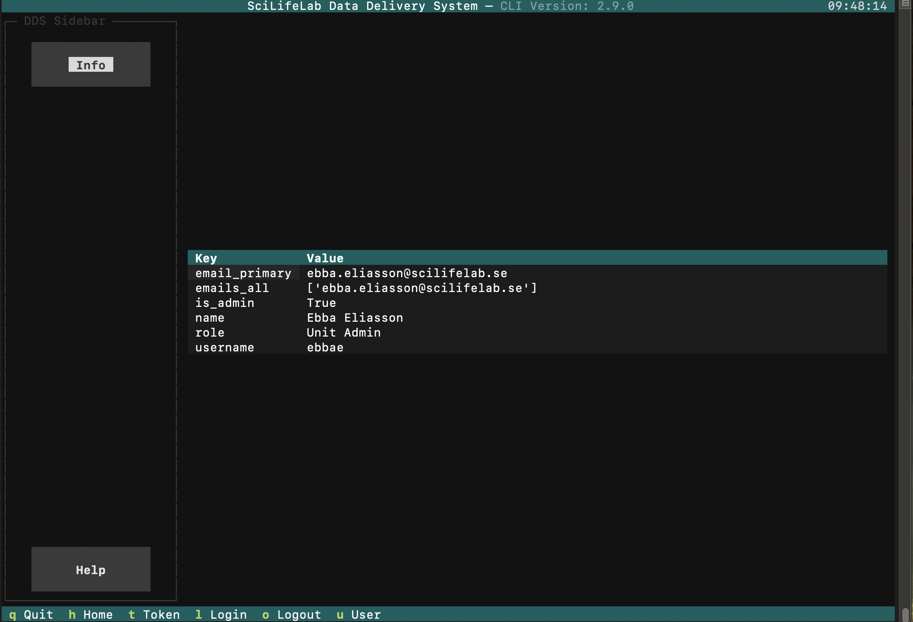
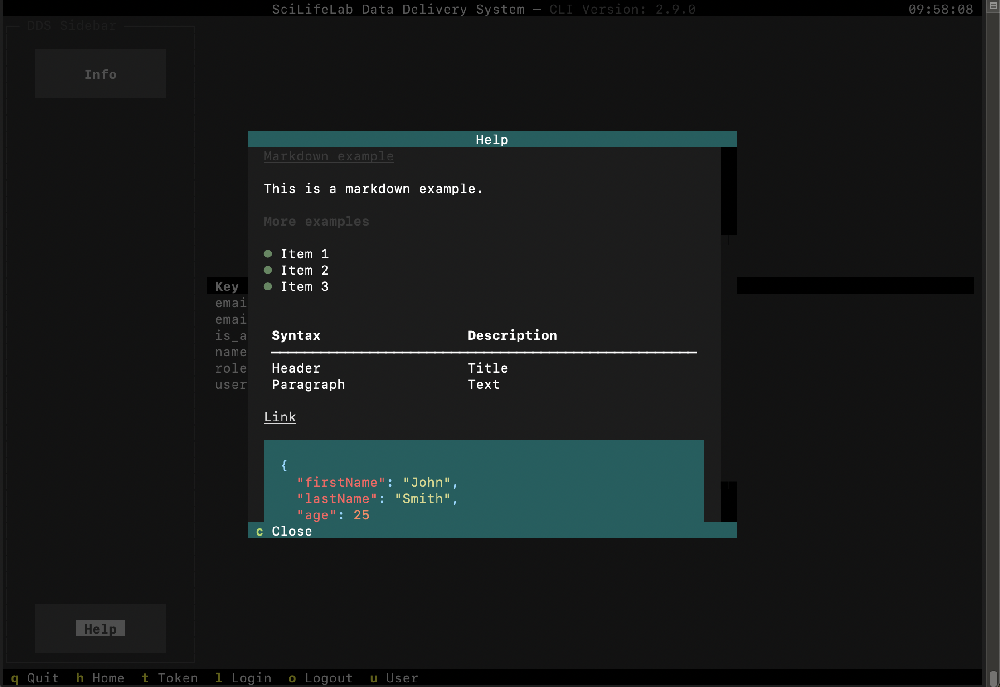

# DDS POC UX/UI

## Component Overview 

Components (possibly) needed for the current DDS CLI commands.

| Component Name | Description | Possible Variants |
|---------------|-------------|----------|
| Input | Text input | Plain input, input with action (button) |
| Button | Button | Text button, icon button, toggle button |
| Confirmaiton dialoge | A confirmaiton modal | Yes/no, Continue/abort |
| Select | Dropdown field with options | Basic select, free solo|
| Checkbox | A checkbox | Basic checkbox |
| Table | Tableview for data displays | Basic table, headerless table, sortable table |
| List | A list | Basic list | 
| Chip | A chip for data display | Default chip, status chip |
| Calender | A calender | Basic calender |
| File manager | File select helper | File selector, directory selector |
| Loading indicator | A loading indicator | Circular loading, dotted loading, loading bar |
| Treeview | Treeview for displaying data hirarchies | Basic treeview |

There will also be layout components, such might be: grids, collapsibles, content switchers, tabs, header, footer, and more. 

For the full documentation, visit [Textual Widget Gallery](https://textual.textualize.io/widget_gallery/).

## Custom components 

There is a possibillity to make custom components or extending widgets. 


## Limitations 

### Images 

There is currently no support for images in textual, bit it is included in the [roadmap](https://textual.textualize.io/roadmap/). There is currently no need for images in the DDS application for functionality. They currently support [rich pixels](https://github.com/darrenburns/rich-pixels) for graphical components. 


# Themes and Styling

Textual supports both application wide themes and styling of default widgets. Styling is done with *tcss* (textal css), and is limited in comparison to regualar css. The supported CSS types can be found [here](https://textual.textualize.io/css_types/) and the textual style implementations [here](https://textual.textualize.io/styles/).


## Theme 

The theme is defined as: 

```` python
primary: str
secondary: str | None = None
warning: str | None = None
error: str | None = None
success: str | None = None
accent: str | None = None
foreground: str | None = None
background: str | None = None
surface: str | None = None
panel: str | None = None
boost: str | None = None
dark: bool = True
luminosity_spread: float = 0.15
text_alpha: float = 0.95
variables: dict[str, str] = field(default_factory=dict)
````
[Source](https://github.com/Textualize/textual/blob/main/src/textual/theme.py). The theme is applied application wide. In the variables you can overwrite component specific styling.

## Limitations 

The textual styling is as said limited in comparison to the full flexibility of CSS styles applications. However, the limited custumization options ensures uniform styling accross the application, both in basic and custom widgets.

There is graphical issues with the default macos terminal. Strange looking colors and borders, see the comparison between iTerm2 (left) and macos default terminal (right). The issues does not effect the functionality.  



**Question**: Ask people to use a different terminal and let it be ugly on macos terminal, or design in such a way that it looks good in macos terminal?

### Text

There is no support for different fontsizes in textual. 

## Issues

Sometimes the colors in textual interact unexpected with eachother, such as layering two colors (for example an alert or modal) can create new strange colors. This can be solved by changing the overlay colors opacity in most cases. 

# Application layout

Textualise utilizes keyboard binding displayed in the footer. In the header you can add a title and subitle, as well as a clock and "menu" in the lift corner (not currently in use, mostly used for swithcing themes).



Token, login and logout are placed inside modals. The modals can also have footers with bindings, in this case a close binding. 



Group commands (in this case user) is availible through the footer bindings and have a layout using a sidebar corresponding to commands. The sidebar can have a title (now "DDS Sidebar") and a help button displaying a modal with markdown. This type of layput could be applied to all command groups. 




