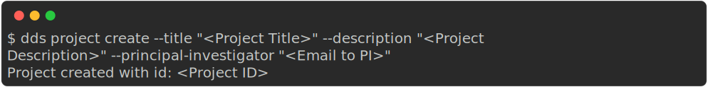
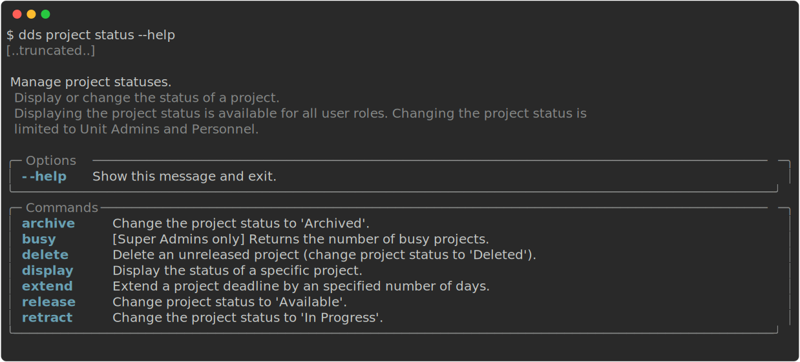
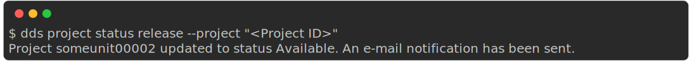
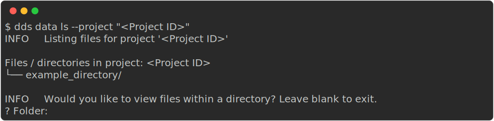
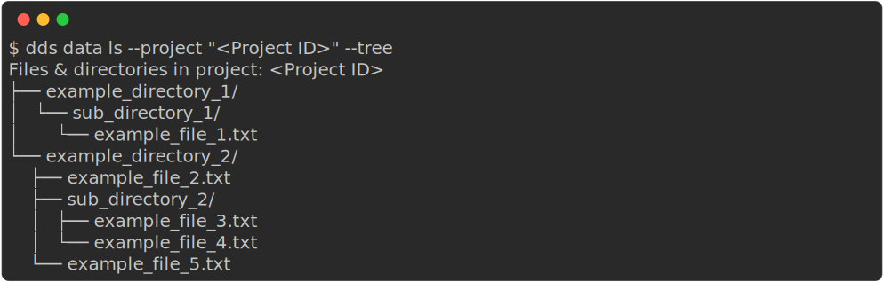

.. _examples:

Examples
=========

.. contents::
   :local:

.. _auth-examples:

Authentication: ``dds auth``
~~~~~~~~~~~~~~~~~~~~~~~~~~~~~

.. _login-example:

Start authenticated session ("Log in")
---------------------------------------

After running the command ``dds auth login``, you will be prompted to fill in information in the following order:

1. Your DDS *username*
2. Your DDS *password*
   
   .. admonition:: The password is hidden
    
        Note that the password *will not be printed out* when you type it; The password is hidden for security purposes.

3. A one time code.
   
   .. admonition:: Email is default

        If you have not configure the 2FA method (see section :ref:`below<2fa-config-example>`), a one time code is sent to your email. If you have set the 2FA method to *Authenticator App*, the one-time code will be shown in that app.

.. image:: ../img/dds-auth-login.svg

.. admonition:: Forgotten your...

    * **Username?** Contact support. Changing username or authenticating with email is currently not possible.
    * **Password?** You can reset your password `here <https://delivery.scilifelab.se/reset_password>`_.

.. danger:: 

    After completing authentication, ``dds-cli`` will automatically save an authentication in the directory where you run the command, unless otherwise specified (see the command documentation). ``dds-cli`` will use this token as a session when you run future commands. 
    The token, and therefore the authenticated session, is valid for 7 days. 
    
    The token is encrypted but **should be kept private**. 

.. _2fa-config-example:

Change Two-Factor Authentication (2FA) method
-----------------------------------------------

There are two possible configurations for the Two-Factor Authentication:

1. Email (*default*)

    A One-Time Code is sent to your registered email address. The code expires when it has been used or after 15 minutes.

2. Authenticator App

    A One-Time Code is displayed in a third-party authenticator app of your choice. A code is valid for 30 seconds.
    
    To set this up:

    1. Install an Authenticator App on your mobile device. 

        Examples of Authenticator Apps: 

        * Authy
        * Google Authenticator
        * Bitwarden

    2. Run
       
       .. code-block:: 

        dds auth twofactor configure

    3. When prompted, choose which method you'd like to use (in this case "Authenticator App")
       
       .. image:: ../img/dds-auth-twofactor-configure.svg

    4. Follow the instructions from the CLI

.. _logout-example: 

End authenticated session ("Log out")
---------------------------------------

In order to avoid unauthorized users accessing the DDS (and thereby your user-privilages and data) via your account, we recommend that you manually end your session after having run the operations with ``dds-cli``. To end the session, run:

.. code-block:: 

    dds auth logout

.. _user-examples:

Manage accounts: ``dds user``
~~~~~~~~~~~~~~~~~~~~~~~~~~~~~~

.. _user-invite-example:

Invite another user
---------------------

In order to invite another user to the DDS, you need to specify their email address and the role which their account should have. 

.. code-block::

    dds user add [Email address] --role "<Account role>"

To invite a user to a specific project, or if they already have an account and should be granted access to the project, add the ``--project`` option.

.. code-block:: 

    dds user add [Email address] --role "<Account role>" --project "<Project ID>"

.. seealso::

    Granting a user access to a specific project can also be done with the ``dds project access`` command. 
    
.. _project-examples:

Manage projects: ``dds project``
~~~~~~~~~~~~~~~~~~~~~~~~~~~~~~~~~

.. _project-create-example:

Create a project
-----------------

.. code-block:: 

      dds project create --title "<Project Title>" --description "<Project Description>" --principal-investigator "<Email to PI>"

.. note::

    The email specified in the option ``--principal-investigator`` does not receive any emails; It's only for information purposes at this time. 
   
When the project is created, you should get an output similar to the one below.

.. _project-status-display-example:

Check the current status of a project
--------------------------------------

A newly created project always has the status "In Progress". 

To check the current status of a project, run:

.. code-block:: 

    dds project status display --project "<Project ID>"

.. _project-status-change-example:

Changing the project status
----------------------------

The command structure when changing a project status is

.. code-block::

    dds project status <statuschange> --project "<Project ID>"

Check the possible status commands with ``dds project status --help``

.. _project-release-example: 

Releasing a project
""""""""""""""""""""

Releasing a project changes the project status from "In Progress" to "Available". 

.. code-block:: 

    dds project status release --project "<Project ID>"
   

.. _data-examples:

Manage data: ``dds data``
~~~~~~~~~~~~~~~~~~~~~~~~~~~~~~~~~

.. _data-list-contents:

List project contents
----------------------

.. seealso::

    You can also list project contents with the command ``dds ls``.

.. _data-list-interactive:

Interactively listing
""""""""""""""""""""""

The following command will list all contents in the *root* directory and ask if you want to view files in any directory. 

.. code-block::

    dds data ls --project "<Project ID>"

.. _data-list-tree:

List full contents (tree)
""""""""""""""""""""""""""

To view all files and directories in a project as a tree structure, use the ``--tree`` opton.

.. code-block::

    dds data ls --project "<Project ID>" --tree

.. _upload-examples:

Upload data
------------

The general upload command is ``dds data put``.

.. code-block::

    dds data put --project "<Project ID>" --source "<File or directory to upload>"

.. _data-put-destination:

Upload to a specific directory
""""""""""""""""""""""""""""""""

To place your uploaded data in a specific (new or existing) directory, use the ``--destination`` option. In the example command below we are uploading one file (``<file>``) and one directory (``<directory>``) with contents of its own.

.. code-block::

    dds data put --project "<Project ID>" --source "<file>" --source "<directory>" --destination "<destination>"

After the upload is completed, the project contents will be the following: 

.. image:: ../img/dds-data-ls-destination.svg

.. _download-examples:

Download data
---------------

Use ``dds data get`` to download data. 

.. _data-get-all:

Download full project contents
""""""""""""""""""""""""""""""""

Use the ``--get-all`` option. 

.. code-block:: 

    dds data get --get-all --project "<Project ID>"

.. _data-get-source:

Download specific files or directories
""""""""""""""""""""""""""""""""""""""""

Use the ``--source`` option to specify which file or directory you want to download within the project. If you want to download multiple individual files or directories, specify the ``--source`` option multiple times.

.. code-block:: 

    dds data get --source "<1st file or directory>" --source "<2nd file or directory>" [... etc] --project "<Project ID>"

.. seealso::

    In order to know which files or directories to specify with the ``--source`` option, you can first list the project contents. See :ref:`this example<data-list-contents>`. 