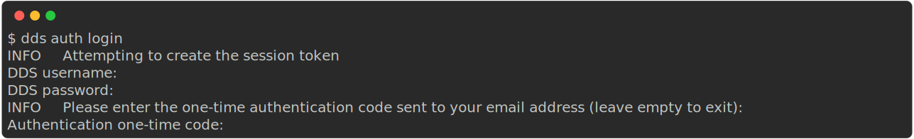

.. _howtouse:

How to use
============

.. _auth-examples:

Authentication: ``dds auth``
~~~~~~~~~~~~~~~~~~~~~~~~~~~~~

Start authenticated session ("Log in"): ``dds auth login``
---------------------------------------------------------------

After running the command ``dds auth login``, you will be prompted to fill in information in the following order:
1. Your DDS *username*
2. Your DDS *password*
   
   .. admonition:: The password is hidden
    
        Note that the password *will not be printed out* when you type it; The password is hidden for security purposes.

3. A one time code.
   
   .. admonition:: Email is default

        If you have not configure the 2FA method (see section :ref:`below<_2fa-config>`), a one time code is sent to your email. If you have set the 2FA method to *Authenticator App*, the one-time code will be shown in that app.

.. admonition:: Forgotten your...

    * **Username?** Contact support. Changing username or authenticating with email is currently not possible.
    * **Password?** You can reset your password `here <https://delivery.scilifelab.se/reset_password>`_.

.. _2fa-config:

Change Two-Factor Authentication (2FA) method: ``dds auth twofactor configure``
------------------------------------------------------------------------------------

End authenticated session ("Log out"): ``dds auth logout``
--------------------------------------------------------------

.. _user-examples:

Manage accounts: ``dds user``
~~~~~~~~~~~~~~~~~~~~~~~~~~~~~~

