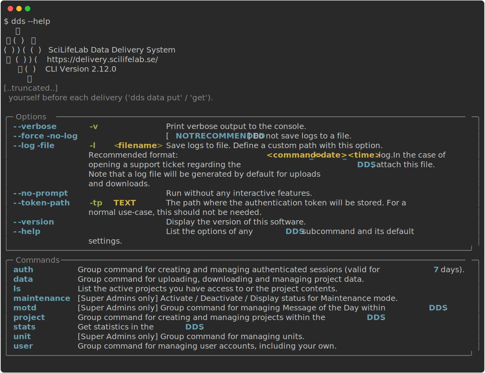
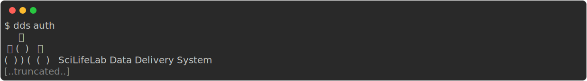
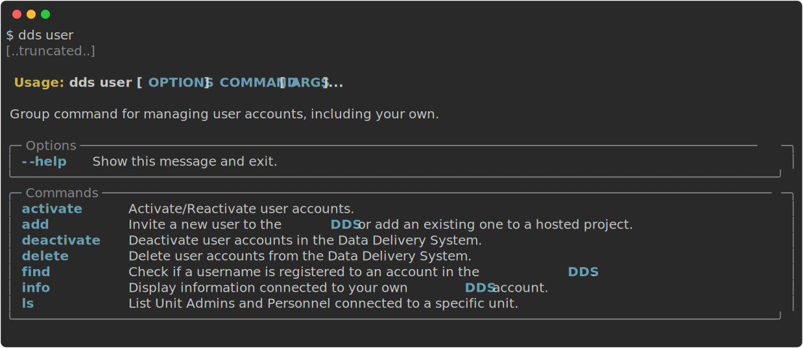
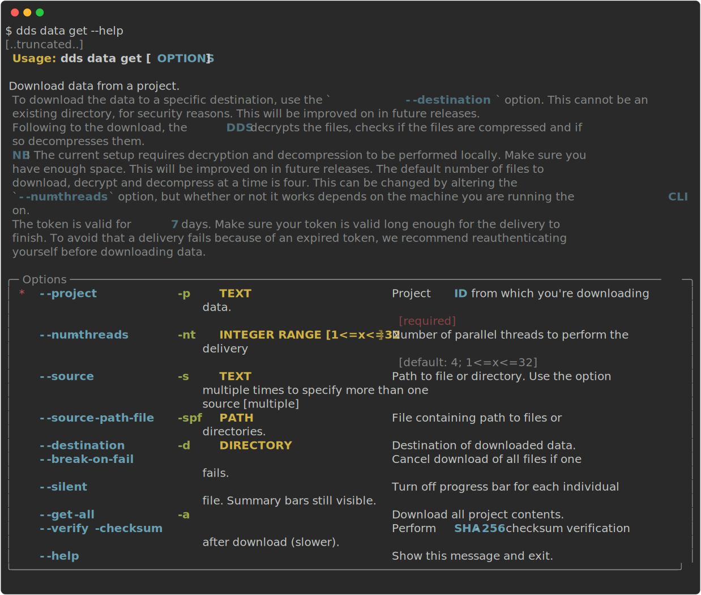

.. Data Delivery System documentation master file, created by
   sphinx-quickstart on Mon Dec  6 10:33:02 2021.
   You can adapt this file completely to your liking, but it should at least
   contain the root `toctree` directive.

==========================
DDS: Data Delivery System
==========================

Welcome to the documentation of the SciLifeLab Data Delivery System's command line interface (``dds-cli``). 

.. contents::
   :local:

.. _whatisit: 

What is the Data Delivery System? 
==================================

The Data Delivery System (DDS, https://delivery.scilifelab.se/) is a tool built for the simple and secure delivery 
of data from SciLifeLab platforms to their users. The system uses Safespring's object storage service as the delivery 
medium, thereby keeping the data within the Swedish borders. The DDS has built-in encryption and key management, 
enabling protection of the data without requiring the users to perform these steps themselves prior to delivery. 

The DDS consists of a command line interface (CLI) and a web interface. The web interface will be improved on as soon 
as possible, but we have decided that having a working CLI and its corresponding API is highest on the priority list. 

.. _howtouse:

How do I use the DDS?
======================

.. _getaccount: 

1. Get an account
~~~~~~~~~~~~~~~~~~

* **I already have an account:** :ref:`Install dds-cli<install>`
* **How do I get an account?** You will need an invite from an existing user. Who the existing user is depends on what you're intending to use the DDS for.
  
  * **I want data delivered to me from a SciLifeLab Unit**: Please contact the unit responsible for delivering the data to you, and ask for an invitation.
  * **I'm a data producer, wanting to deliver data to my users**
    
    * *My unit does not have DDS set up:* Start by contacting the SciLifeLab Data Centre at **delivery@scilifelab.se**.
    * *My unit has started using the DDS for data deliveries:* Contact your colleagues and ask for an invitation.

   .. note:: 

      The invitation email will be from `services-noreply@scilifelab.se`. Note that any emails sent to this address **will not be responded to**. 
      
      **Not receiving an email?**
      
      * Please check in the junk/spam folder. 
      * My email address has the `scilifelab.se` domain: It may take a while for your email to be delivered, due to KTH spam filters.
      * If none of these help you, contact support. 

   Once you get the invitation email, follow the link in the email and register your account. After this, you should have access to the system. To be able to use the CLI (which contains most of the functionality) please follow the installation guide :ref:`below<install>`.

   .. warning::
      Forgetting passwords in the DDS means that you will lose access to all project data. We highly recommend that you use a password management system such as `Bitwarden <https://bitwarden.com/>`_, `LastPass <https://www.lastpass.com/>`_ or similar.

      When resetting a password you can, of course, regain access to the projects you lost access to. You will get information on how when you perform a password reset.

Your account will be either a *Unit Admin*, *Unit Personnel* or a *Researcher* account. These are called the different roles which define the commands and actions you are allowed to perform in the DDS, including some administrative permissions. For more information about the roles, please check out the `technical overview <https://delivery.scilifelab.se/technical>`_. 

.. _install:

2. Install the command line interface (CLI): ``dds-cli``
~~~~~~~~~~~~~~~~~~~~~~~~~~~~~~~~~~~~~~~~~~~~~~~~~~~~~~~~~

.. note:: 
   
   At this time you must use the DDS CLI in order to utilize the majority of the DDS functionalities. This includes upload and download of data. 

* **I have already installed the CLI:** :ref:`Run the CLI<runit>`
* **I do not have the CLI installed:** Please follow the instructions below.

In order to use the DDS, you first need to install the CLI. The installation process varies depending on which operating system you are on, or if you are on Uppmax.

**I am on...**

* :ref:`MacOS / Linux<mac-linux>` 
* :ref:`Windows<windows>`
* :ref:`Uppmax<uppmax>`

.. _runit:

3. Run the CLI
~~~~~~~~~~~~~~~

Although the command line tool is installed as ``dds-cli``, the main command is run as ``dds``. The command ``dds`` has some options and possible customisations. A detailed list of these can be found :ref:`here<dds-main>` or by running ``dds --help``.

   
.. _auth-info:

"Logging in" / Authentication
--------------------------------------

In order to use the ``dds-cli`` functionality, you first need to authenticate yourself. Authentication is handled by the ``dds auth`` command, which creates and manages authenticated sessions. These sessions are *valid for 7 days*.

.. seealso::
   
   * Examples on how to use ``dds auth`` :ref:`here<auth-examples>`
   * Full ``dds auth`` documentation :ref:`here<dds-auth>`

.. _user-info:

I want to give someone else access to the DDS, how do I do that?
------------------------------------------------------------------

The ``dds user`` command allows you to manage your own and, if you have administrative permissions, other user accounts. This includes inviting new users. Your invitation privileges depends on your account role. 

* **How do I know which role my account has?** 
  You can get information about your account by running ``dds user info`` (after authenticating)

   .. image:: ../img/dds-user-info.svg

* **Which account roles can I invite?**
  The `technical overview <https://delivery.scilifelab.se/technical>`_ has a detailed description of which actions each account role can perform.

.. seealso:: 

  * Examples on how to use ``dds user`` :ref:`here<user-examples>`
  * Full ``dds user`` documentation :ref:`here<dds-user>`

.. _how-to-deliver:

How do I deliver data to our users? 
-------------------------------------

.. note:: 

   This section only applies to the account roles *Unit Admin* and *Unit Personnel*. 

1. In order to deliver data, you first need to create a project in the DDS. Projects are created and managed with the ``dds project`` command.

   .. image:: ../img/dds-project.svg

   An example on how to create a project can be found :ref:`here<project-create-example>`

2. Upload the data with the ``dds data put`` command. 

   .. image:: ../img/dds-data-put.svg
   
   Examples on how to upload data can be found :ref:`here<upload-examples>`

3. Finally, you will need to make the data available to your users. This is called "releasing" the project and is also handled by the ``dds project`` command.

   An example on how to release the project can be found :ref:`here<project-release-example>`
   
.. seealso:: 

   * Examples on how to use ``dds project`` :ref:`here<project-examples>`
   * Full ``dds project`` documentation :ref:`here<dds-project>`

   * Examples on how to use ``dds data`` :ref:`here<data-examples>`
   * Full ``dds data`` documentation :ref:`here<dds-data>`

.. _how-to-download:

How do I get my delivered data?
---------------------------------

Once the unit has uploaded your data and made it available to you, you can download it to your location of choice with the ``dds data get`` command.

.. note::
   
   **Downloading the data to Uppmax?** Follow the instructions :ref:`here<uppmax>` first.

* **I want to download everything in a project:** See :ref:`this example<data-get-all>` 
* **I want to download a specific file or folder:** See :ref:`this example<data-get-source>`

Command documentation and guide
================================

.. toctree::
   :maxdepth: 1

   Welcome page <self>
   installation
   examples
   dds (Main command) <main>
   auth
   user
   project
   data
   ls
   unit

Indices and tables
==================

* :ref:`genindex`
* :ref:`modindex`
* :ref:`search`
