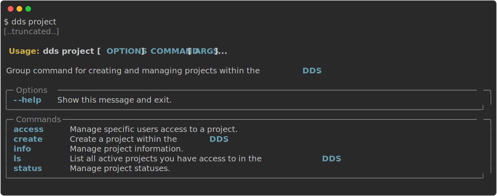

.. Data Delivery System documentation master file, created by
   sphinx-quickstart on Mon Dec  6 10:33:02 2021.
   You can adapt this file completely to your liking, but it should at least
   contain the root `toctree` directive.

=====================================================================
Welcome to the Data Delivery Systems' Documentation!
=====================================================================

The Data Delivery System (DDS, https://delivery.scilifelab.se/) consists of a command line interface (CLI) and a web interface. The web interface will be improved on as soon as possible, but we have decided that having a working CLI and its corresponding API is highest on the priority list. 

.. _account:

How do I get my user account?
===============================
An invite from an existing user is required in order for you to get an account within the DDS. The email will be from `services-noreply@scilifelab.se`, we will notify you if and when this changes. Note that any emails sent to this address regarding the DDS *will not be responded to*. If you do not get an email, please have a look in the junk/spam folder. If your email adress has the `scilifelab.se` domain, keep in mind that your emails may take a while to deliver due to the KTH spam filters. If you do not receive an email, please contact support. 

* **I want data delivered to me from a SciLifeLab Unit**: Please contact the unit responsible for delivering the data to you.
* **I'm a data producer, wishing to deliver data to my users**: If your unit does not have DDS set up, start by contacting the SciLifeLab Data Centre. If your unit *has* started using the DDS for data deliveries, contact your colleagues. 

Once you get the invitation email, follow the link in the email and register your account. After this, you should have access to the system. To be able to use the CLI (which contains most of the functionality) please follow the installation guide :ref:`below<cli>`.

.. warning::
   Forgetting passwords in the DDS means that you will lose access to all project data. We highly recommend that you use a password management system such as `LastPass <https://www.lastpass.com/>`_ or similar.

   When resetting a password you can, of course, regain access to the projects you lost access to. You will get information on how when you perform a password reset.

Your account will be either a *Unit Admin*, *Unit Personnel* or a *Researcher* account. These are called the different roles which define the commands and actions you are allowed to perform in the DDS, including some administrative permissions. For more information about the roles, please read the `technical overview <https://github.com/ScilifelabDataCentre/dds_web/blob/dev/doc/Technical-Overview.pdf>`_. 

Installation
=============

* :ref:`MacOS / Linux<mac-linux>` 
* :ref:`Windows<windows>`
* :ref:`Uppmax<uppmax>`

-------

.. _cli:

How to run the CLI
====================

The main command ``dds`` has some options and possible customisations. A detailed list of these can be found :ref:`here<dds-main>` or by running ``dds --help``. The sub/group commands are ``dds auth``, ``dds user``, ``dds project``, ``dds data``, ``dds ls`` and ``dds unit``, as seen in the output below.

.. image:: ../img/dds-help-2.svg
   
Some commands should not be possible to successfully run from a Researcher account. The affected commands are marked with asterisks (\*\*\*).

.. _auth-info:

:ref:`dds auth<dds-auth>`
~~~~~~~~~~~~~~~~~~~~~~~~~~
``dds auth`` and its subcommands are used for creating and managing sessions. This will enable you to use the CLI without specifying your user credentials for a certain amount of time, currently 7 days. 

.. image:: ../img/dds-auth.svg

.. admonition:: Accessible by
   
   All user roles.

See the command documentation :ref:`here<dds-auth>`.

.. _user-info:

:ref:`dds user<dds-user>`
~~~~~~~~~~~~~~~~~~~~~~~~~~
You can use the ``add user`` group command to manage your own and (if you have administrative permissions) other user accounts. 

.. image:: ../img/dds-user.svg

.. admonition:: Accessible by
   
   All user roles. Some subcommands are limited to Unit Admins, Unit Personnel and in come cases Researchers marked as Project Owners for specific projects.

See the command documentation :ref:`here<dds-user>`.

.. _project-info:

:ref:`dds project<dds-project>`
~~~~~~~~~~~~~~~~~~~~~~~~~~~~~~~~
The ``dds project`` command is for creating and managing projects. The majority of the functionalities regarding project management is only available to *Unit Admin* and *Unit Personnel* accounts.

.. admonition:: Accessible by
   
   Researchers can use the ``dds project ls``.
   Researchers marked as Project Owners in specific projects can also use ``dds project access grant/revoke``. 
   The rest of the subcommands are limited to Unit Admins and Unit Personnel.

See the command documentation :ref:`here<dds-project>`.

.. _data-info:

:ref:`dds data<dds-data>`
~~~~~~~~~~~~~~~~~~~~~~~~~~~
The ``dds data`` group command is used for uploading, downloading, listing and deleting data. Only **Unit Admin** and **Unit Personnel** accounts can upload and delete data. All account types can list and download. 

.. image:: ../img/dds-data.svg

.. admonition:: Accessible by
   
   Researchers can use `dds data get`.
   The rest of the subcommands are limited to Unit Admins and Unit Personnel.

See the command documentation :ref:`here<dds-data>`.

.. _ls-info:

:ref:`dds ls<dds-ls>`
~~~~~~~~~~~~~~~~~~~~~~
The ``dds ls`` group command can be used for listing both projects and project contents. Calling the ``dds ls`` command should produce the same output as ``dds project ls``, and calling ``dds ls --project`` should result in the same output as when calling ``dds data ls``. 

.. admonition:: Accessible by
   
   All user roles.

See the command documentation :ref:`here<dds-ls>`.

.. _unit-info:

:ref:`dds unit<dds-unit>`
~~~~~~~~~~~~~~~~~~~~~~~~~~

The ``dds unit`` group command can be used by Super Admins to list all units and their information. 

.. admonition:: Accessible by
   
   Super Admins only.

Command documentation and guide
================================

.. toctree::
   :maxdepth: 1

   installation
   main
   auth
   user
   project
   data
   ls
   unit

Indices and tables
==================

* :ref:`genindex`
* :ref:`modindex`
* :ref:`search`
